## 1.0 Style Transfer Using Convolutional Neural Networks (CNN) ##
A python script capable of blending style attributes from one image with the
structural content of another.

A style image and content image exist as complete images. A blank "output" image is
also created. The thrust of the script is to minimize the content difference between
the content image and the output image, whilst simulatenously minimizing the style
difference between the style image and the output image. The ultimate goal is to project
the different qualities of the two images onto the blank image, composing the two within
the new image.

Aggregating the sub-loss functions into a larger loss function allows the problem
to be abstracted away as an optimization problem. A truncated, pre-trained VGG16 model
created by Oxfords Visual Geometry Group was used as the convolution network. Whilst
scipy's L-BFGS-B optimization algorithm was used to iteratively hone the total loss experienced
by the composition image.

Some of the results have been included, though the quality would benefit from a more
well-endowed computer and/or some AWS credits..

## 1.1 Initial Results
<table style="width:100%" align="center">
  <tr>
    <td></td>
    <td>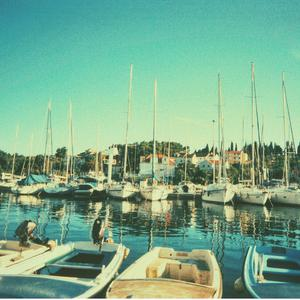</td>
    <td>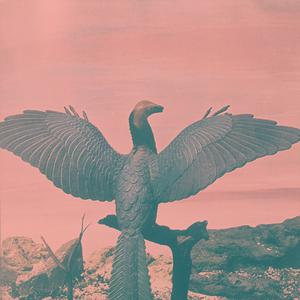</td>
    <td>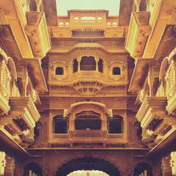</td>
  </tr>
  <tr>
    <td>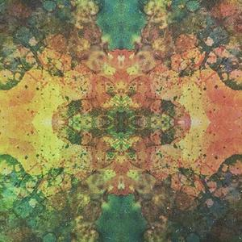</td>
    <td>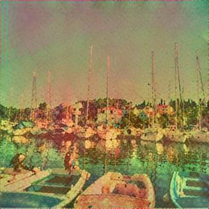</td>
    <td>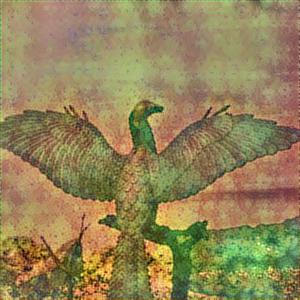</td>
    <td>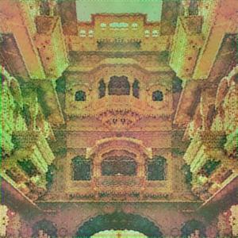</td>
  </tr>
  <tr>
    <td>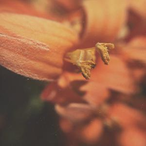</td>
    <td>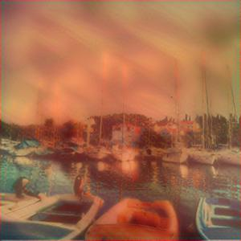</td>
    <td>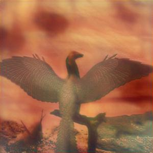</td>
    <td>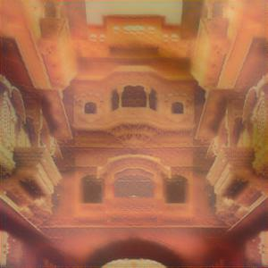</td>
  </tr>
  <tr>
    <td>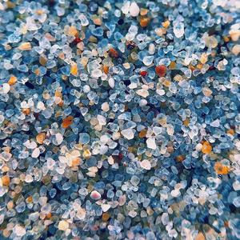</td>
    <td>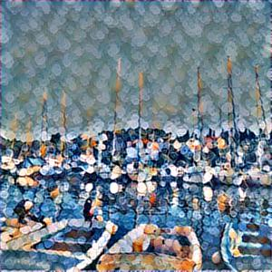</td>
    <td>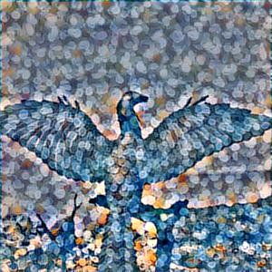</td>
    <td>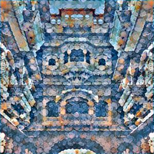</td>
  </tr>
</table>

## 2.0 Getting Started ##
Ensure that all required libraries are available for use within the environment. In particular, ensure that
Keras is using Tensorflow as the backend.

Place content and style images in the appropriate subdirectories before running. The script will process and create
all image combinations based upon the images supplied within these directories. Within the app/output directory,
additional directories corresponding to the content images will be created, inside these directories a predictable
organizational structure will also be created based upon the content/style composition images.

## 2.1 Prerequisite Libraries ##
Developed using Python 3.6.2, Tensorflow 1.4.0, Keras 2.1.4, PIL 5.0, NumPy 1.13.3 and SciPy 1.0.0.

## 3.0 Authors ##
Sam Hardy - Implementation

## 3.1 Acknowledgments ##
Big thanks to Siraj Raval for managing to compress and spice dense topics like Neural Networks
into reasonably short youtube clips, they're an excellent starting point.
Another big thanks to Harish Narayanan for his blog entry which formed the basis for the
entire script, an excellent overview of CNN as well as some very necessary pre-material (linear, non-linear classifiers, score functions etc.)

## 4.0 Resources ##
| Title/Author  | Link  |
| ------------- | ----- |
| "Convolutional neural networks for artistic style transfer" - Harish Narayanan     | https://harishnarayanan.org/writing/artistic-style-transfer/ |
| "How Convolutional neural networks see the world" - Keras Blog     |   https://blog.keras.io/how-convolutional-neural-networks-see-the-world.html |
| "MNIST for ML Beginners" - Tensorflow Blog |    https://www.tensorflow.org/get_started/mnist/beginners |
| "How to Generate Art - Intro to Deep Learning #8" - Siraj Raval | https://www.youtube.com/watch?v=Oex0eWoU7AQ |
